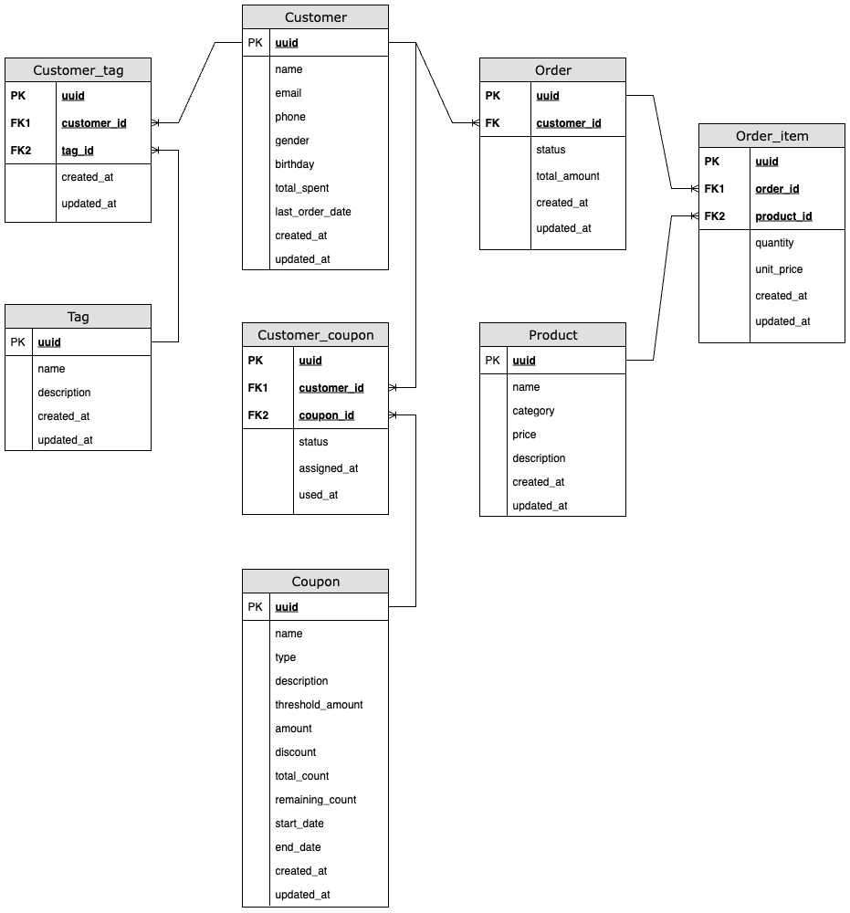

# CRM 客戶關係管理系統

一個基於 Node.js + Express + PostgreSQL 的 CRM 系統，提供客戶分群與行銷功能以及優惠券管理系統。

## 📋 目錄

- [功能特色](#功能特色)
- [技術棧](#技術棧)
- [專案結構](#專案結構)
- [安裝與設定](#安裝與設定)
- [資料庫設計](#資料庫設計)
- [API 文件](#api-文件)
- [測試說明](#測試說明)
- [開發說明](#開發說明)

## 🚀 功能特色

### CRM 客戶分群與行銷功能
- **客戶分群查詢**：支援消費金額、時間範圍、客戶標籤等複合條件篩選
- **行銷簡訊發送**：對篩選出的客戶群發送個人化行銷簡訊
- **動態範本**：支援 `{name}`、`{totalSpent}`、`{lastOrderDate}` 等動態變數

### 優惠券系統
- **優惠券管理**：創建、查詢優惠券
- **優惠券領取**：支援併發控制，防止超發
- **優惠券使用**：驗證有效性並扣除庫存
- **狀態查詢**：查詢使用者所有優惠券狀態

## 🛠 技術棧

- **後端框架**：Node.js + Express.js
- **資料庫**：PostgreSQL
- **驗證**：express-validator
- **UUID**：uuid v4
- **其他**：dotenv (環境變數管理)

## 💻 開發說明

### 架構設計原則

1. **分層架構**：Controller → Service → Database
    - Controller：處理 HTTP 請求與回應
    - Service：執行業務邏輯
    - Database：資料存取操作
2. **單一責任**：每個模組專注於特定功能
    - Controller 只處理請求驗證與回應格式
    - Service 包含所有業務邏輯
    - Middleware 負責通用功能（驗證、錯誤處理）
3. **依賴注入**：Service 層獨立於 Controller，便於測試與維護
4. **錯誤處理**：所有錯誤透過 errorHandler middleware 統一處理
5. **資料驗證**：使用 express-validator 在 middleware 層統一驗證

### 併發控制

優惠券領取使用悲觀鎖來防止超發：
```sql
-- 使用 FOR UPDATE 鎖定記錄
SELECT * FROM coupon WHERE uuid = $1 FOR UPDATE;
```

### 動態變數系統

簡訊範本支援以下動態變數：
- `{name}`: 客戶姓名
- `{totalSpent}`: 總消費金額
- `{lastOrderDate}`: 最後消費日期

---

**注意**：此專案為面試作品展示，專注於核心功能實現與程式碼品質。

## 📁 專案結構

```
new-retail-crm/
├── scripts/
│   └── setup-db.js                 # 資料庫初始化腳本
├── src/
│   ├── controllers/                # API 控制層
│   │   ├── customerController.js   # 客戶相關控制器
│   │   ├── couponController.js     # 優惠券控制器
│   │   └── marketingController.js  # 行銷功能控制器
│   ├── routes/                     # 路由定義
│   │   ├── customers.js            # 客戶路由
│   │   ├── coupons.js              # 優惠券路由
│   │   └── marketing.js            # 行銷路由
│   ├── services/                   # 業務邏輯層
│   │   ├── couponService.js        # 優惠券業務邏輯
│   │   ├── customerService.js      # 客戶業務邏輯
│   │   └── smsService.js           # 簡訊服務
│   ├── config/                     # 配置檔案
│   │   ├── database.js             # 資料庫連線設定
│   │   └── init-db.sql             # 資料庫初始化 + 測試資料
│   ├── middleware/                 # 中介軟體
│   │   ├── errorHandler.js         # 錯誤處理中介軟體
│   │   └── validation.js           # 資料驗證中介軟體
│   ├── app.js                      # Express 應用程式設定
│   └── server.js                   # 伺服器啟動入口
├── docs/                           # 文件資料夾
│   └── erd.png                     # 資料庫 ERD 圖
├── .env                            # 環境變數檔案
├── .gitignore                      # Git 忽略清單
├── package.json                    # 專案配置與依賴
└── README.md                       # 專案說明文件
```

## ⚙️ 安裝與設定

### 環境需求
- Node.js (建議版本 16.x 或以上)
- PostgreSQL (建議版本 12.x 或以上)
- Git

### 1. 複製專案
```bash
git clone https://github.com/ChubbyKay/new-retail-crm.git
cd new-retail-crm
```

### 2. 安裝依賴
```bash
npm install
```

### 3. 環境設定
建立 `.env` 檔案：
```env
# 資料庫設定
DB_HOST=localhost
DB_PORT=5432
DB_NAME=new_retail_db
DB_USER=your_username
DB_PASSWORD=your_password

# 伺服器設定
PORT=3000
NODE_ENV=development
```

> **📝 注意**：請將 `your_username` 和 `your_password` 替換為您實際的 PostgreSQL 使用者帳號和密碼。

### 4. 資料庫設定

#### 方法一：使用 PostgreSQL 命令列工具
```bash
# 建立資料庫 (需要先登入 PostgreSQL)
createdb new_retail_db

# 或使用 psql
psql -U your_username -c "CREATE DATABASE new_retail_db;"
```

#### 方法二：使用 pgAdmin 或其他圖形化工具
1. 開啟 pgAdmin
2. 連接到您的 PostgreSQL 伺服器
3. 建立名為 `new_retail_db` 的新資料庫

#### 執行初始化腳本
```bash
npm run setup-db
```

### 5. 啟動伺服器

#### 開發模式 (推薦)
```bash
npm run dev
```
> 使用 nodemon，檔案變更時會自動重啟伺服器

#### 正式環境
```bash
npm run start
```

### 6. 驗證安裝
伺服器啟動後，您應該會看到類似以下的訊息：
```
Server is running on port 3000
Environment: development
```

## 🗄️ 資料庫設計


### ER 圖關係
- Customer ↔ Customer_Tag ↔ Tag (多對多關係)
- Customer → Order (一對多關係)
- Order → Order_Item ↔ Product (多對多關係)
- Customer ↔ Customer_Coupon ↔ Coupon (多對多關係)


## 📚 API 文件

### 客戶分群 API

#### 客戶分群查詢
```http
GET /api/marketing/segments
```

**查詢參數**：
- `minAmount` (number, optional): 最小消費金額，預設 0
- `days` (number, optional): 近幾天內的消費，預設 30
- `tags` (string|array, optional): 客戶標籤

**範例請求**：
```http
GET /api/marketing/segments?minAmount=500&days=30&tags=VIP
```

**回應範例**：
```json
{
  "success": true,
  "message": "客戶分群查詢成功",
  "data": {
    "criteria": {
      "minAmount": 500,
      "days": 30,
      "tags": ["VIP"]
    },
    "customers": [
      {
        "uuid": "123e4567-e89b-12d3-a456-426614174000",
        "name": "張三",
        "email": "zhang@example.com",
        "phone": "0912345678",
        "total_spent": "15680.00",
        "last_order_date": "2024-12-07T10:30:00.000Z"
      }
    ],
    "totalCount": 1
  }
}
```

#### 發送行銷簡訊
```http
POST /api/marketing/sms/send
```

**請求體**：
```json
{
  "template": "親愛的 {name}，您的累積消費已達 {totalSpent}，感謝您的支持！",
  "customerUuids": ["uuid1", "uuid2"],
  // 或者使用動態篩選
  "criteria": {
    "minAmount": 500,
    "days": 30,
    "tags": ["VIP"]
  }
}
```

**回應範例**：
```json
{
  "success": true,
  "message": "簡訊發送完成",
  "data": {
    "template": "親愛的 {name}，您的累積消費已達 {totalSpent}，感謝您的支持！",
    "foundVariables": ["{name}", "{totalSpent}"],
    "variableCount": 2,
    "sendResult": {
      "totalCount": 2,
      "successCount": 2,
      "failCount": 0,
      "details": [...]
    }
  }
}
```

### 優惠券 API

#### 創建優惠券
```http
POST /api/coupons
```

**請求體**：
```json
{
  "name": "新年優惠券",
  "type": "fixed",
  "description": "滿1000減100",
  "threshold_amount": 1000,
  "amount": 100,
  "total_count": 1000,
  "start_date": "2024-01-01T00:00:00Z",
  "end_date": "2024-01-31T23:59:59Z"
}
```

**回應範例**：
```json
{
  "success": true,
  "message": "優惠券創建成功",
  "data": {
    "uuid": "123e4567-e89b-12d3-a456-426614174001",
    "name": "新年優惠券",
    "type": "fixed",
    "description": "滿1000減100",
    "threshold_amount": 1000,
    "amount": 100,
    "total_count": 1000,
    "claimed_count": 0,
    "start_date": "2024-01-01T00:00:00.000Z",
    "end_date": "2024-01-31T23:59:59.000Z",
    "status": "pending",
    "created_at": "2024-12-07T10:30:00.000Z"
  }
}
```

#### 查詢優惠券列表
```http
GET /api/coupons
```

**查詢參數**：
- `type` (string, optional): 優惠券類型 (percentage/fixed_amount)
- `status` (string, optional): 優惠券狀態 (active/pending/expired/sold_out)
- `onlyAvailable` (boolean, optional): 是否只顯示可用的優惠券，預設 true
- `limit` (number, optional): 每頁數量
- `offset` (number, optional): 偏移量

**範例請求**：
```http
GET /api/coupons?type=fixed_amount&limit=10&offset=0
```

**回應範例**：
```json
{
  "success": true,
  "message": "優惠券查詢成功",
  "data": {
    "coupons": [
      {
        "uuid": "123e4567-e89b-12d3-a456-426614174001",
        "name": "新年優惠券",
        "type": "fixed_amount",
        "description": "滿1000減100",
        "threshold_amount": 1000,
        "amount": 100,
        "total_count": 1000,
        "claimed_count": 250,
        "start_date": "2024-01-01T00:00:00.000Z",
        "end_date": "2024-01-31T23:59:59.000Z",
        "status": "active"
      }
    ],
    "totalCount": 1,
    "pagination": {
      "limit": 10,
      "offset": 0,
      "hasMore": false
    }
  }
}
```

#### 查詢特定優惠券詳情
```http
GET /api/coupons/{id}
```

**路徑參數**：
- `id` (string): 優惠券UUID

**範例請求**：
```http
GET /api/coupons/123e4567-e89b-12d3-a456-426614174000
```

**回應範例**：
```json
{
  "success": true,
  "message": "優惠券查詢成功",
  "data": {
    "uuid": "123e4567-e89b-12d3-a456-426614174000",
    "name": "新年優惠券",
    "type": "fixed_amount",
    "description": "滿1000減100",
    "threshold_amount": 1000,
    "amount": 100,
    "total_count": 1000,
    "claimed_count": 250,
    "start_date": "2024-01-01T00:00:00.000Z",
    "end_date": "2024-01-31T23:59:59.000Z",
    "status": "active",
    "created_at": "2024-12-01T10:30:00.000Z",
    "updated_at": "2024-12-07T10:30:00.000Z"
  }
}
```

### 客戶優惠券 API

#### 領取優惠券
```http
POST /api/customers/{customerId}/coupons/{couponId}/claim
```

**路徑參數**：
- `customerId` (string): 客戶UUID
- `couponId` (string): 優惠券UUID

**範例請求**：
```http
POST /api/customers/75badad8-1cfb-487d-96b4-6620274e91ae/coupons/5f459f26-1f09-4982-a1f0-3379c31d8032/claim
```

**回應範例**：
```json
{
  "success": true,
  "message": "優惠券領取成功",
  "data": {
    "customerCouponId": "efd79d0a-dd0a-438c-a73c-357cf7b076fb",
    "customerId": "75badad8-1cfb-487d-96b4-6620274e91ae",
    "couponId": "5f459f26-1f09-4982-a1f0-3379c31d8032",
    "status": "unused",
    "claimed_at": "2024-12-07T10:30:00.000Z",
    "coupon": {
      "name": "新年優惠券",
      "type": "fixed_amount",
      "description": "滿1000減100",
      "threshold_amount": 1000,
      "amount": 100,
      "end_date": "2024-01-31T23:59:59.000Z"
    }
  }
}
```

#### 使用優惠券
```http
POST /api/customers/{customerId}/coupons/{customerCouponId}/use
```

**路徑參數**：
- `customerId` (string): 客戶UUID
- `customerCouponId` (string): 客戶持有的優惠券記錄UUID

**請求體**：
```json
{
  "order_amount": 1500
}
```

**範例請求**：
```http
POST /api/customers/75badad8-1cfb-487d-96b4-6620274e91ae/coupons/efd79d0a-dd0a-438c-a73c-357cf7b076fb/use
```

**回應範例**：
```json
{
  "success": true,
  "message": "優惠券使用成功",
  "data": {
    "customerCouponId": "efd79d0a-dd0a-438c-a73c-357cf7b076fb",
    "customerId": "75badad8-1cfb-487d-96b4-6620274e91ae",
    "couponId": "5f459f26-1f09-4982-a1f0-3379c31d8032",
    "status": "used",
    "used_at": "2024-12-07T10:30:00.000Z",
    "order_amount": 1500,
    "discount_amount": 100,
    "final_amount": 1400,
    "coupon": {
      "name": "新年優惠券",
      "type": "fixed_amount",
      "description": "滿1000減100",
      "threshold_amount": 1000,
      "amount": 100
    }
  }
}
```

#### 查詢客戶擁有的優惠券
```http
GET /api/customers/{customerId}/coupons
```

**路徑參數**：
- `customerId` (string): 客戶UUID

**查詢參數**：
- `status` (string, optional): 篩選優惠券狀態 (unused/used/expired)
- `coupon_type` (string, optional): 篩選優惠券類型 (percentage/fixed_amount)
- `limit` (number, optional): 回傳的資料筆數上限
- `offset` (number, optional): 資料偏移量，用於分頁

**範例請求**：
```http
GET /api/customers/75badad8-1cfb-487d-96b4-6620274e91ae/coupons?status=unused&coupon_type=percentage&limit=10&offset=0
```

**回應範例**：
```json
{
  "success": true,
  "message": "客戶優惠券查詢成功",
  "data": {
    "customerId": "75badad8-1cfb-487d-96b4-6620274e91ae",
    "coupons": [
      {
        "customerCouponId": "efd79d0a-dd0a-438c-a73c-357cf7b076fb",
        "couponId": "5f459f26-1f09-4982-a1f0-3379c31d8032",
        "status": "unused",
        "claimed_at": "2024-12-05T10:30:00.000Z",
        "used_at": null,
        "coupon": {
          "name": "新年優惠券",
          "type": "percentage",
          "description": "全館9折優惠",
          "threshold_amount": 500,
          "amount": 10,
          "start_date": "2024-01-01T00:00:00.000Z",
          "end_date": "2024-01-31T23:59:59.000Z"
        }
      }
    ],
    "totalCount": 1,
    "pagination": {
      "limit": 10,
      "offset": 0,
      "hasMore": false
    }
  }
}
```

## 🧪 測試說明

### 測試資料情境

專案包含完整的測試資料，涵蓋以下情境：

1. **高消費近期活躍客戶** (VIP + 高消費標籤)
   - 張三: 15,680元，5天前消費
   - 李四: 8,750元，12天前消費
   - 王五: 12,300元，18天前消費

2. **新客戶** (新客戶標籤)
   - 吳新客: 300元，3天前消費
   - 李新手: 850元，9天前消費

3. **流失風險客戶** (超過90天未消費)
   - 古老客: 5,200元，120天前消費
   - 舊客戶: 8,900元，150天前消費

### 基本測試範例

#### 1. 測試近30天消費超過500元的客戶
```bash
curl "http://localhost:3000/api/marketing/segments?minAmount=500&days=30"
```

#### 2. 測試VIP客戶分群
```bash
curl "http://localhost:3000/api/marketing/segments?tags=VIP"
```

#### 3. 測試行銷簡訊發送
```bash
curl -X POST "http://localhost:3000/api/marketing/sms/send" \
  -H "Content-Type: application/json" \
  -d '{
    "template": "親愛的 {name}，您的累積消費已達 {totalSpent}！",
    "criteria": {
      "minAmount": 1000,
      "days": 30
    }
  }'
```

### 優惠券測試範例

#### 4. 創建優惠券
```bash
curl -X POST "http://localhost:3000/api/coupons" \
  -H "Content-Type: application/json" \
  -d '{
    "name": "測試優惠券",
    "type": "fixed",
    "description": "滿500減50",
    "threshold_amount": 500,
    "amount": 50,
    "total_count": 100,
    "start_date": "2024-01-01T00:00:00Z",
    "end_date": "2024-12-31T23:59:59Z"
  }'
```

#### 5. 查詢所有可用優惠券
```bash
curl "http://localhost:3000/api/coupons?onlyAvailable=true&limit=10"
```

#### 6. 依類型篩選優惠券
```bash
curl "http://localhost:3000/api/coupons?type=fixed_amount&status=active"
```

### 需要 UUID 的測試範例

> **⚠️ 注意**：以下測試需要先從上述 API 回應中取得實際的 UUID 值

#### 7. 查詢特定優惠券詳情
```bash
# 請先從步驟4或5的回應中取得實際的優惠券UUID
curl "http://localhost:3000/api/coupons/{COUPON_UUID}"

# 範例（請替換為實際UUID）：
# curl "http://localhost:3000/api/coupons/123e4567-e89b-12d3-a456-426614174000"
```

#### 8. 客戶領取優惠券
```bash
# 請先從客戶分群API取得客戶UUID，從優惠券API取得優惠券UUID
curl -X POST "http://localhost:3000/api/customers/{CUSTOMER_UUID}/coupons/{COUPON_UUID}/claim"

# 範例（請替換為實際UUID）：
# curl -X POST "http://localhost:3000/api/customers/75badad8-1cfb-487d-96b4-6620274e91ae/coupons/123e4567-e89b-12d3-a456-426614174000/claim"
```

#### 9. 查詢客戶擁有的優惠券
```bash
# 請先從客戶分群API取得客戶UUID
curl "http://localhost:3000/api/customers/{CUSTOMER_UUID}/coupons"

# 範例（請替換為實際UUID）：
# curl "http://localhost:3000/api/customers/75badad8-1cfb-487d-96b4-6620274e91ae/coupons?status=unused"
```

#### 10. 使用優惠券
```bash
# 請先從步驟9的回應中取得 customerCouponId
curl -X POST "http://localhost:3000/api/customers/{CUSTOMER_UUID}/coupons/{CUSTOMER_COUPON_ID}/use" \
  -H "Content-Type: application/json" \
  -d '{
    "order_amount": 1000
  }'

# 範例（請替換為實際UUID）：
# curl -X POST "http://localhost:3000/api/customers/75badad8-1cfb-487d-96b4-6620274e91ae/coupons/efd79d0a-dd0a-438c-a73c-357cf7b076fb/use" \
#   -H "Content-Type: application/json" \
#   -d '{"order_amount": 1000}'
```

### 測試流程建議

建議按照以下順序進行完整測試：

1. **基礎查詢測試**：先執行步驟 1-3，確認客戶分群和簡訊功能正常
2. **優惠券管理測試**：執行步驟 4-6，測試優惠券的創建和查詢功能
3. **UUID 相關測試**：
   - 從步驟 4 的回應中複製優惠券 UUID，用於步驟 7
   - 從步驟 1 的回應中複製客戶 UUID，用於步驟 8-10
   - 從步驟 8 的回應中複製 customerCouponId，用於步驟 10
